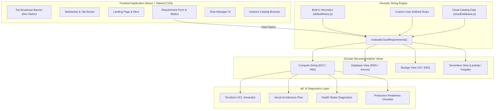
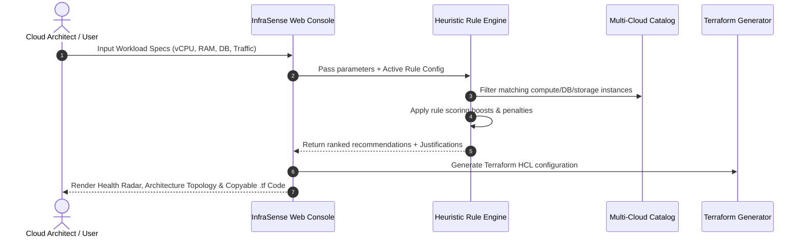

# 🌩️ InfraSense — Cloud Infrastructure Recommendation & Decision Platform

[](https://react.dev/)
[](https://vitejs.dev/)
[](https://tailwindcss.com/)
[](https://www.terraform.io/)
[](LICENSE)
[](https://github.com/Ismail-dcode/Infrasense/pulls)

**InfraSense** is an enterprise-grade cloud infrastructure recommendation platform and architecture decision engine. Designed for Cloud Architects, DevOps Engineers, and Developers, InfraSense dynamically evaluates workload specifications, computes instance sizing across **AWS, Azure, and GCP**, applies customizable heuristic rule engines, scores infrastructure health, and exports production-ready **Terraform IaC (Infrastructure as Code)**.

---

> ### 📢 Active Development Notice
> **🤖 AI Recommendation Assistant:** Natural language architecture generation is currently in active development for Phase 2!  
> **⚡ Fully Functional Now:** Explore the interactive **Manual Cloud Console**, **15+ Rule Heuristic Engine**, and **Terraform IaC Generator** live right now on the platform.

---

## 🚀 Live Demo & Links

- 🌐 **Live Web Application:** [https://infrasence.ismailshaikh.in](https://infrasence.ismailshaikh.in/)
 main
- 👨‍💻 **Developer Portfolio:** [https://ismailshaikh.in](https://ismailshaikh.in)

---

## 📌 Table of Contents

- [Platform Overview](#-platform-overview)
- [Interactive 4-Step Sizing Workflow](#-interactive-4-step-sizing-workflow)
- [Key Features](#-key-features)
- [System Architecture & Data Flow](#-system-architecture--data-flow)
- [Project Directory Structure](#-project-directory-structure)
- [Tech Stack](#-tech-stack)
- [Getting Started](#-getting-started)
- [Rule Engine Customization](#-rule-engine-customization)
- [Terraform IaC Generator](#-terraform-iac-generator)
- [🗺️ Future Planning & Roadmap](#️-future-planning--roadmap)
- [🤝 Contributing](#-contributing)
- [📄 License & Author](#-license--author)

---

## 💡 Platform Overview

Choosing cloud infrastructure across AWS, Azure, and Google Cloud is notoriously complex: hundreds of instance types, opaque pricing models, and confusing architectural trade-offs often lead to over-provisioned resources and wasted cloud budgets.

**InfraSense solves this by providing:**
1. **Transparent Heuristic Evaluation:** Rather than relying on black-box estimates, InfraSense evaluates workloads through 15+ benchmark rules with plain-English justification tags.
2. **Multi-Domain Sizing:** Sizing for Virtual Compute (EC2 / VMs), Managed Databases (RDS / Aurora), Cloud Storage (S3 / EBS), and Serverless / Containers (Lambda / Fargate).
3. **Instant Infrastructure as Code:** Turn recommendations into fully functional, production-ready Terraform HCL configurations in one click.
4. **Health Diagnostics:** Real-time 5-axis radar charts scoring Cost Efficiency, Performance, Reliability, Security, and Scalability.

---

## 🔄 Interactive 4-Step Sizing Workflow

```
┌───────────────────────────┐      ┌───────────────────────────┐
│ 1. Select Cloud Domain    │ ───► │ 2. Configure Hardware     │
│    Compute, DB, Storage   │      │    vCPU, RAM, Disk, IOPS  │
└───────────────────────────┘      └───────────────────────────┘
              │                                  │
              ▼                                  ▼
┌───────────────────────────┐      ┌───────────────────────────┐
│ 3. Enterprise Hardening   │ ───► │ 4. Output & IaC Export    │
│    Multi-AZ, Security, HA │      │    Scoring, Radar, .tf    │
└───────────────────────────┘      └───────────────────────────┘
```

### 1️⃣ Step 1: Select Cloud Domain & Workload Profile
* **Category Switcher:** Select between **Virtual Servers (EC2 / VMs)**, **Managed Databases (RDS / Aurora)**, **Cloud Storage & S3**, or **Serverless & Containers (Lambda / Fargate)**.
* **One-Click Presets:** Instant templates for **High-Traffic Web Apps**, **PostgreSQL Databases**, **AI/ML GPU Inference**, and **Low-Cost MVPs**.

### 2️⃣ Step 2: Configure Hardware & Traffic Parameters
* **Instance Scale:** Choose single-node dev servers, dual active-active setups, or 5+ node production microservice clusters.
* **Hardware Precision Sliders:** Adjust vCPU cores (1 to 64), RAM memory (1 to 256 GB), storage capacity, and SSD IOPS throughput.
* **Workload-Aware Profiling:** Classify workloads (Memory-Heavy DB, Compute-Intensive Batch, Burstable Web, Network-Bound API).

### 3️⃣ Step 3: Multi-Cloud Target & Enterprise Hardening
* **Multi-Cloud Filtering:** Target AWS, Microsoft Azure, Google Cloud (GCP), or compare all three simultaneously.
* **Enterprise Features:** Toggle 24/7 CloudWatch Monitoring, Multi-AZ High Availability with automated failover, and KMS Data Encryption at Rest.
* **Budget Strategy:** Align scoring algorithms with **Lowest Monthly Bill**, **Balanced Performance**, or **Maximum Throughput**.

### 4️⃣ Step 4: Actionable Recommendations, Health Radar & Terraform IaC
* **Top Instance Match:** Ranked primary recommendation with exact hourly rates, estimated monthly spend, and explicit reasoning.
* **Alternative Fits:** Compare the Lowest Cost alternative against the Maximum Performance alternative.
* **Health Radar Scores:** 5-axis metric scoring Cost, Performance, Reliability, Security, and Scalability (0–100%).
* **1-Click Terraform Export:** Copy-paste ready HashiCorp HCL code with VPC, subnets, instances, and DB configurations.

---

## 🚀 Key Features

### 🖥️ 1. Multi-Category Infrastructure Sizing
- **Virtual Compute:** Precision sizing for AWS EC2 (t3, c6i, m6i, r6i, g4dn), Azure VMs (B-series, D-series, E-series, NC-series), and GCP Compute Engine (e2, n2, c2, n2d, g2).
- **Managed Databases:** Sizing engine for AWS RDS (PostgreSQL/MySQL), Aurora Serverless v2, Azure SQL, and GCP Cloud SQL with IOPS & backup evaluations.
- **Object & Block Storage:** S3 tiering optimizer (Standard, Intelligent-Tiering, Glacier) and EBS block volume calculator (`gp3` vs `io2`).
- **Serverless & Containers:** Direct cost and architecture comparison between AWS Lambda, AWS ECS Fargate, AWS App Runner, and GCP Cloud Run.

### ⚡ 2. Transparent Heuristic Rule Engine
- Evaluates inputs through 15+ deterministic heuristic rules in [`src/engine/ruleEngine.js`](file:///c:/Users/Lenovo/Documents/Development-Stuff/infrasence/src/engine/ruleEngine.js).
- Provides plain-English justification tags for every boost or penalty applied.
- Interactive **Rule Manager** lets engineers enable, disable, or author new custom scoring rules dynamically.

### 📊 3. Infrastructure Health Scores & Diagnostics
- Multi-dimensional health radar evaluating Cost, Performance, Reliability, Security, and Scalability (0–100%).
- Real-time recommendations for missing backup strategies, lack of multi-AZ failover, or burstable CPU risks.

### ⚙️ 4. Automated Terraform IaC Generator
- Generates standard, clean HashiCorp HCL Terraform configuration code ready for `terraform init` and `terraform apply`.
- Includes VPC networking, subnet layout, security groups, auto-scaling compute, and database resources.

### 🛡️ 5. Production Hardening Checklist
- Pre-deployment security checklist covering IAM least-privilege, KMS key rotation, automated snapshots, SSL termination, and CloudWatch alarm setups.

---

## 📐 System Architecture & Data Flow

### Platform Component Architecture (Mermaid)



### End-to-End Evaluation Flow



---

## 📁 Project Directory Structure

```
infrasence/
├── index.html                               # HTML5 entrypoint
├── package.json                             # Project dependencies & scripts
├── postcss.config.js                        # PostCSS configuration
├── tailwind.config.js                       # Tailwind styling tokens & keyframes
├── vite.config.js                           # Vite build configuration
└── src/
    ├── App.jsx                              # Global layout & tab navigation router
    ├── main.jsx                             # React DOM bootstrap
    ├── index.css                            # Global styles, glassmorphism & ticker keyframes
    ├── hooks/
    │   ├── useAppTabs.js                    # Tab state management (Home, Console, Docs, Dev)
    │   └── useScrollReveal.js               # IntersectionObserver animations
    ├── pages/
    │   ├── LandingPage.jsx                  # Marketing homepage & interactive hero
    │   ├── ConsolePage.jsx                  # Main recommendation calculator console
    │   ├── DocumentationPage.jsx            # Deep-dive architecture & heuristic docs
    │   └── DeveloperPage.jsx                # Creator info, tech stack & open source
    ├── components/
    │   ├── BroadcastBanner.jsx              # Top announcement banner (Dev status ticker)
    │   ├── CalculatorApp.jsx                # Sizing workbench container
    │   ├── RequirementForm.jsx              # Interactive workload parameter form
    │   ├── RecommendationResult.jsx         # Primary compute instance result card
    │   ├── DatabaseRecommendationView.jsx   # Managed database recommendation view
    │   ├── StorageRecommendationView.jsx    # S3 & EBS volume recommendation view
    │   ├── ServerlessRecommendationView.jsx # Lambda vs Fargate sizing view
    │   ├── TerraformGenerator.jsx           # Production Terraform HCL generator
    │   ├── ArchitectureDiagram.jsx          # Visual topology diagram
    │   ├── InfrastructureHealthScores.jsx   # Radar chart health diagnostics
    │   ├── DeploymentChecklist.jsx          # Production hardening checklist
    │   ├── InstanceCatalog.jsx              # Searchable cloud instance directory
    │   ├── RuleManager.jsx                  # Heuristic rule toggle & creator modal
    │   ├── RuleEvaluationLoader.jsx         # Calculation pulse animation
    │   ├── PresetSelector.jsx               # Workload profile modal
    │   ├── SecurityAndMonitoringAdvisor.jsx # CloudWatch & IAM advisor
    │   ├── ToolNavbar.jsx                   # Sub-navigation bar for console tabs
    │   └── landing/
    │       ├── SiteNavbar.jsx               # Top header navigation
    │       ├── Hero.jsx                     # Hero banner with rotating prompt typewriter
    │       ├── HowItWorks.jsx               # 4-step visual workflow
    │       ├── ProductDetails.jsx           # Tabbed feature deep-dive
    │       ├── Features.jsx                 # Platform capability cards
    │       ├── CodeSnippets.jsx             # Live Terraform & Rule engine preview
    │       ├── WhoIsItFor.jsx               # Target audience cards
    │       ├── CallToAction.jsx             # Launch calculator CTA
    │       ├── Footer.jsx                   # Site footer with useful links
    │       └── ScrollReveal.jsx             # Micro-animation wrapper
    ├── data/
    │   ├── cloudDatabase.js                 # Catalog database (AWS, Azure, GCP specs)
    │   └── defaultRules.js                  # Built-in heuristic rule definitions
    └── engine/
        └── ruleEngine.js                    # Core scoring algorithms & conditions
```

---

## 🛠️ Tech Stack

| Domain | Technology | Purpose |
| :--- | :--- | :--- |
| **UI Framework** | [React 18](https://react.dev/) | Declarative component architecture & modern hooks |
| **Bundler & Server** | [Vite 5](https://vitejs.dev/) | Instant HMR development and optimized production bundling |
| **Styling** | [Tailwind CSS 3](https://tailwindcss.com/) | Curated utility classes, dark-mode styling & custom keyframe animations |
| **Icons** | [Lucide React](https://lucide.dev/) | Comprehensive vector cloud, server, and architecture icons |
| **IaC Language** | [HashiCorp Terraform (HCL)](https://www.terraform.io/) | Standard Infrastructure as Code output format |
| **Visual Effects** | [Canvas Confetti](https://www.npmjs.com/package/canvas-confetti) | Visual celebration on optimal architecture calculation |

---

## 💻 Getting Started

### Prerequisites

Ensure you have **Node.js** (v18.0.0 or higher) and **npm** installed:

```bash
node -v
npm -v
```

### Installation & Local Run

1. **Clone the repository:**
   ```bash
   git clone https://github.com/Ismail-dcode/Infrasense.git
   cd Infrasense
   ```

2. **Install project dependencies:**
   ```bash
   npm install
   ```

3. **Start local development server:**
   ```bash
   npm run dev
   ```
   Open your browser at `http://localhost:5173`.

4. **Build for production:**
   ```bash
   npm run build
   ```

5. **Preview production bundle:**
   ```bash
   npm run preview
   ```

---

## ⚙️ Rule Engine Customization

InfraSense uses a rule-based constraint system defined in [`src/engine/ruleEngine.js`](file:///c:/Users/Lenovo/Documents/Development-Stuff/infrasence/src/engine/ruleEngine.js). Every rule inspects the user input and modifies the relative weight score of candidate instances.

### Rule Schema Example

```javascript
{
  id: 'rule-high-mem-db',
  name: 'Database Memory Ratio Boost',
  category: 'workload',
  severity: 'high',
  description: 'Boost memory-optimized instance families (AWS r6i, Azure E-series, GCP n2d-highmem) for relational database engines.',
  reason: 'Relational databases benefit from large RAM buffer pools to keep working index pages cached in memory.',
  enabled: true,
  condition: (input) => input.workload === 'relational_db' || input.ram >= 32,
  applyWeight: (instance) => {
    if (instance.family.startsWith('r') || instance.family.startsWith('E') || instance.family.includes('highmem')) {
      return 25; // Adds +25 score bonus to memory-optimized instances
    }
    return 0;
  }
}
```

---

## 📜 Terraform IaC Generator

InfraSense dynamically constructs clean, modular Terraform HCL files based on the chosen instance, storage parameters, and provider settings:

```hcl
# Generated by InfraSense Cloud Infrastructure Recommendation Engine
# Workload: Production High-Traffic Web API
# Target Provider: AWS | Region: us-east-1

terraform {
  required_version = ">= 1.5.0"
  required_providers {
    aws = {
      source  = "hashicorp/aws"
      version = "~> 5.0"
    }
  }
}

provider "aws" {
  region = "us-east-1"
}

resource "aws_vpc" "infrasense_vpc" {
  cidr_block           = "10.0.0.0/16"
  enable_dns_hostnames = true
  enable_dns_support   = true
  tags = {
    Name        = "infrasense-production-vpc"
    Environment = "production"
    ManagedBy   = "InfraSense"
  }
}

resource "aws_instance" "primary_compute" {
  ami           = "ami-0c55b159cbfafe1f0"
  instance_type = "t3.medium"
  count         = 2

  root_block_device {
    volume_size           = 100
    volume_type           = "gp3"
    iops                  = 3000
    throughput            = 125
    encrypted             = true
    delete_on_termination = true
  }

  tags = {
    Name = "infrasense-web-node"
  }
}
```

---

## 🗺️ Future Planning & Roadmap

InfraSense is actively evolving from a heuristic decision engine into an end-to-end intelligent Cloud Architecture & FinOps platform. Here is our roadmap:

```
┌────────────────────────────────────────────────────────────────────────────────────────┐
│                                 INFRASENSE ROADMAP                                     │
├─────────────────────────┬──────────────────────────────┬───────────────────────────────┤
│  PHASE 1 (COMPLETED)    │  PHASE 2 (IN PROGRESS)       │  PHASE 3 (PLANNED)            │
│  ✅ Heuristic Engine    │  🚀 AI Natural Language NLP  │  🔮 Live Cloud Pricing APIs   │
│  ✅ Multi-Cloud Catalog │  🚀 Hybrid Verification      │  🔮 Multi-IaC (Pulumi/CDK)    │
│  ✅ Terraform Export    │  🚀 Architecture Copilot     │  🔮 FinOps Waste Scanner      │
│  ✅ Health Diagnostics  │  🚀 Auto Diagram Generation  │  🔮 Team Architecture Collab  │
└─────────────────────────┴──────────────────────────────┴───────────────────────────────┘
```

### 📍 Phase 1: Foundation & Heuristic Engine *(Completed ✅)*
- [x] Multi-cloud database for AWS, Azure, and GCP compute, database, storage, and serverless instances.
- [x] Transparent rule engine with 15+ benchmark rules.
- [x] Interactive Rule Manager to add and toggle custom heuristics in real time.
- [x] Multi-tab interface (Landing, Console, Documentation, Developer).
- [x] Dynamic Terraform IaC HCL generation with copyable blocks.
- [x] Infrastructure Health Radar and Production Hardening Checklist.
- [x] Pre-configured workload presets (E-Commerce, Microservices, AI/ML, MVP).

### 📍 Phase 2: AI-Powered Infrastructure Assistant *(In Active Development 🚀)*
- [ ] **Natural Language Workload Parser (LLM Integration):** Convert conversational prompts (e.g., *"Design an e-commerce platform for 100k daily shoppers with Redis caching and PostgreSQL on AWS"*) into exact hardware parameters.
- [ ] **Hybrid AI + Heuristic Verification Layer:** Eliminate AI hallucinations by running LLM-generated specs through deterministic heuristic validation rules to guarantee valid instance types and accurate pricing.
- [ ] **Interactive Architecture Copilot:** Chat-based assistant to explain cost trade-offs, discuss Multi-AZ vs Single-AZ resilience, and suggest cloud-native migrations.
- [ ] **AI-to-Topology Diagram Synthesizer:** Automatically generate exportable Mermaid & SVG architecture diagrams directly from natural language prompts.

### 📍 Phase 3: Live Cloud APIs & FinOps Intelligence *(Planned 🔮)*
- [ ] **Real-Time Cloud Pricing Integration:** Connect with AWS Price List API, Azure Retail Prices API, and GCP Cloud Billing Catalog for automated daily spot & on-demand price synchronization.
- [ ] **Multi-IaC Format Support:** Export architectures not just in Terraform, but also in **Pulumi (TypeScript/Python)**, **AWS CDK**, and **Kubernetes manifests (`k8s.yaml` & Helm charts)**.
- [ ] **FinOps Waste & Carbon Footprint Scanner:** Estimate environmental CO2 impact (Green Cloud computing) and suggest Reserved Instance (RI) / Savings Plan strategies.
- [ ] **Team Workspaces & Architecture Permalinks:** Save architectures to shareable URLs and export executive architecture summary reports in PDF/PNG format.

---

## 🤝 Contributing

Contributions are warmly welcomed! Whether you want to add new instance families, author new heuristic rules, or contribute to the Phase 2 AI engine:

1. **Fork the Repository**
2. **Create a Feature Branch:**
   ```bash
   git checkout -b feature/awesome-new-rule
   ```
3. **Commit Your Changes:**
   ```bash
   git commit -m "feat: add heuristic rule for GPU memory bandwidth"
   ```
4. **Push to Your Branch:**
   ```bash
   git push origin feature/awesome-new-rule
   ```
5. **Open a Pull Request** on GitHub.

### Adding New Cloud Instances
To add new instance families or update specifications, edit [`src/data/cloudDatabase.js`](file:///c:/Users/Lenovo/Documents/Development-Stuff/infrasence/src/data/cloudDatabase.js).

### Adding New Heuristic Rules
To contribute new architectural rules, add definitions into [`src/data/defaultRules.js`](file:///c:/Users/Lenovo/Documents/Development-Stuff/infrasence/src/data/defaultRules.js).

---

## 📄 License & Author

Distributed under the **MIT License**. See `LICENSE` for more information.

### Developed by
**Ismail Shaikh**  
- 🌐 **Portfolio:** [https://ismailshaikh.in](https://ismailshaikh.in)
- 🐙 **GitHub:** [@Ismail-dcode](https://github.com/Ismail-dcode)
- 💼 **LinkedIn:** [Ismail Shaikh](https://linkedin.com/in/ismail-shaikh)
- 🌩️ **Project:** [InfraSense Cloud Platform](https://infrasence.ismailshaikh.in)

---

<p align="center">
  Crafted with ❤️ for Cloud Architects, DevOps Engineers, and System Designers.
</p>
