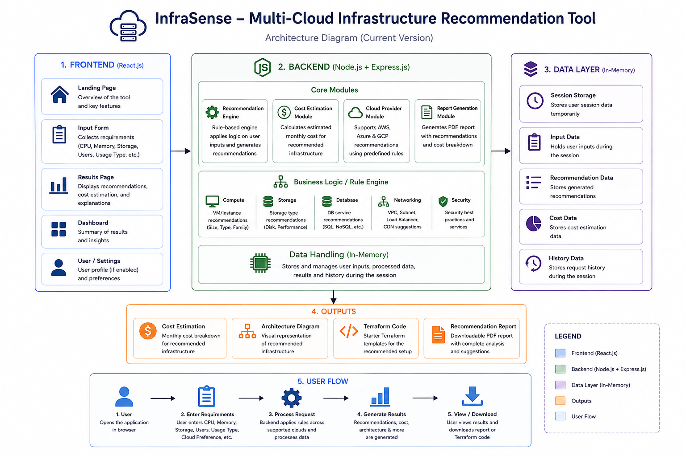
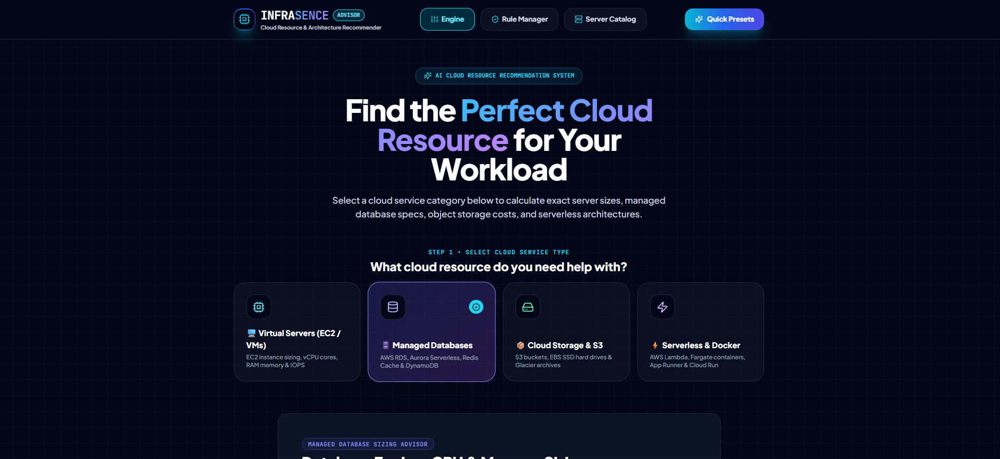
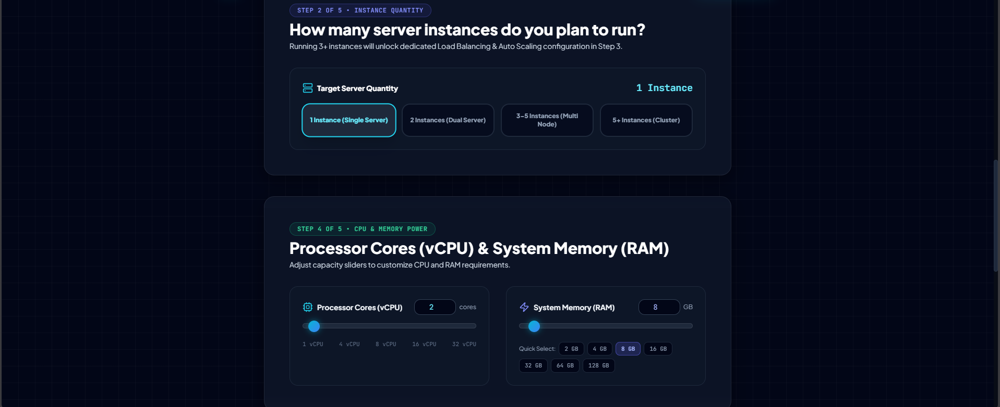
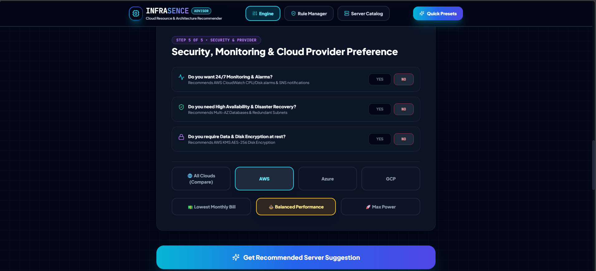
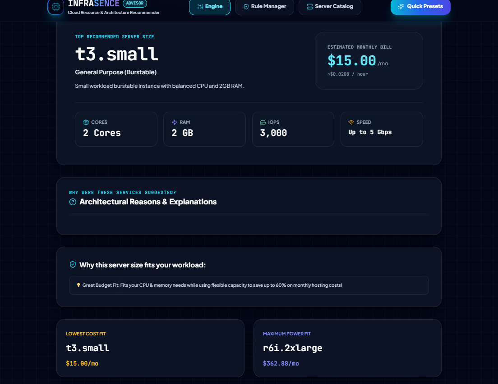
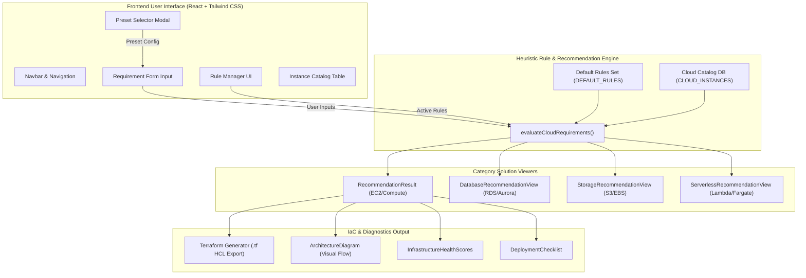
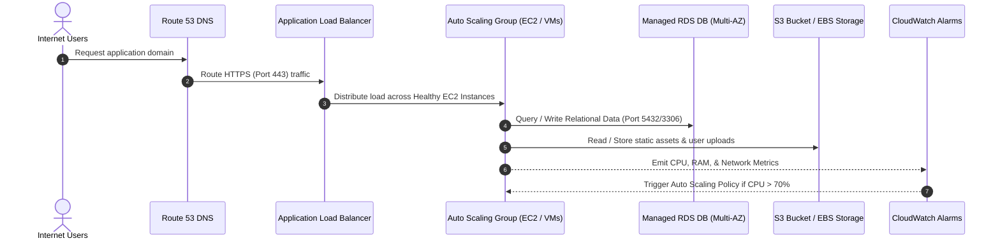

# 🌩️ InfraSense — Cloud Infrastructure Recommendation & Decision Platform

[](https://react.dev/)
[](https://vitejs.dev/)
[](https://tailwindcss.com/)
[](https://www.terraform.io/)
[](LICENSE)

**InfraSense** is an enterprise-grade cloud infrastructure recommendation platform and decision engine. Designed for Cloud Architects, DevOps Engineers, and System Administrators, InfraSense dynamically evaluates workload requirements, calculates compute, database, storage, and serverless specifications across cloud providers (AWS, GCP, Azure), applies custom heuristic rule engines, scores infrastructure health, and exports copy-pasteable **Terraform IaC (Infrastructure as Code)** configurations.  

---
 ## 🚀 Live Demo 🔗 [Visit InfraSense](https://infrasence.ismailshaikh.in/)
---
<br>


     
=======
     
>>>>>>> 96b3f822c30b139cb7b5f8b800e99f45d7f43e85


---

## 📸 Application Screenshots & Step-by-Step Walkthrough

Follow this step-by-step visual workflow to see how InfraSense analyzes workload requirements and generates cloud resource recommendations:

### 1️⃣ Step 1: Select Cloud Service Category & Workload Type


* **Overview**: Select the cloud infrastructure domain you need help sizing: **Virtual Servers (EC2 / VMs)**, **Managed Databases**, **Cloud Storage & S3**, or **Serverless & Docker**.
* **Quick Presets**: Click **Quick Presets** in the top navigation bar to instantly populate the calculator with pre-configured workload profiles (e.g., High-Traffic E-Commerce, Microservice API, AI/ML Inference, or Low-Cost MVP).

---

### 2️⃣ Step 2: Configure Server Instances & Hardware Specs


* **Target Instance Quantity**: Select how many server instances you plan to run (Single Server, Dual Active-Active, 3–5 Node Cluster, or 5+ Microservices).
* **vCPU & RAM Sliders**: Fine-tune processor core requirements (defaults to **2 vCPU cores** and **2 GB RAM**) tailored to your application load.
* **Storage Speed & IOPS**: Set required IOPS and SSD disk parameters for high read/write operations.

---

### 3️⃣ Step 3: Set Security, Monitoring & Cloud Provider Preferences


* **Enterprise Hardening**: Toggle options for 24/7 CloudWatch Monitoring & Alarms, Multi-AZ High Availability & Disaster Recovery, and KMS Data Encryption at Rest.
* **Multi-Cloud Target**: Choose your preferred cloud provider (**AWS**, **Azure**, **GCP**, or **All Clouds Compare**).
* **Budget Priority**: Control scoring algorithms by selecting **Lowest Monthly Bill**, **Balanced Performance**, or **Max Power**.

---

### 4️⃣ Step 4: View Intelligent Recommendations & Infrastructure Insights


* **Top Recommended Instance**: View the top-scored instance match (e.g., `t3.small` / `t3.medium`) along with hourly rates and estimated monthly costs.
* **Architectural Justifications**: Read clear heuristic explanations of why the server size was chosen based on your input parameters.
* **Alternative Options & IaC Export**: Compare **Lowest Cost Fit** vs **Maximum Power Fit**, inspect Infrastructure Health Scores, and generate production-ready **Terraform IaC** HCL templates.

---
## 📌 Table of Contents

- [Key Features](#-key-features)
- [System Architecture & Workflow](#-system-architecture--workflow)
- [Architecture Diagram Snippets](#-architecture-diagram-snippets)
- [Application Screenshots & Step-by-Step Walkthrough](#-application-screenshots--step-by-step-walkthrough)
- [Project Directory Structure](#-project-directory-structure)
- [Tech Stack](#-tech-stack)
- [Getting Started](#-getting-started)
- [Rule Engine Customization](#-rule-engine-customization)
- [Terraform IaC Generator](#-terraform-iac-generator)
- [Contributing & License](#-contributing--license)

---

## 🚀 Key Features

### 🖥️ 1. Multi-Category Infrastructure Sizing
- **Virtual Compute (EC2 / Compute Engine / Azure VMs)**: Calculates exact vCPU, RAM, network throughput, and IOPS parameters to select optimal instance families (e.g., `t3.medium`, `c6i.xlarge`, `r6i.2xlarge`, `m6i.4xlarge`).
- **Managed Relational & NoSQL Databases**: Evaluates AWS RDS, Aurora Serverless v2, DynamoDB, and Redis caching layers based on connections, IOPS, and read/write ratios.
- **Cloud Storage & S3 Sizing**: S3 Tiering recommendations (Standard, Intelligent-Tiering, Glacier Flexible Archive) and EBS SSD volume sizing (`gp3` vs `io2`).
- **Serverless & Containers**: Recommends AWS Lambda vs ECS Fargate vs AWS App Runner vs GCP Cloud Run based on execution duration, concurrency, and request volume.

### ⚡ 2. Heuristic Rule & Constraint Engine
- Evaluates compute requests through a customizable rule pipeline ([ruleEngine.js](file:///c:/Users/Lenovo/Documents/Development-Stuff/infrasence/src/engine/ruleEngine.js)).
- Rules adjust instance scores dynamically based on workload characteristics (e.g., burstable CPU penalties for high-traffic apps, memory ratio bonuses for database workloads).
- Interactive **Rule Manager** ([RuleManager.jsx](file:///c:/Users/Lenovo/Documents/Development-Stuff/infrasence/src/components/RuleManager.jsx)) allows real-time enabling/disabling of system rules and adding custom user-defined condition rules.

### 🏛️ 3. Visual Infrastructure Topology
- Renders dynamic architecture diagrams detailing traffic flow: **Route 53 DNS → Application Load Balancer (ALB) → Auto Scaling Group (EC2) → Multi-AZ Database → CloudWatch Monitoring & Alarms**.

### ⚙️ 4. Automated Terraform IaC Generation
- Converts selected recommendations into production-ready HCL configuration files ([TerraformGenerator.jsx](file:///c:/Users/Lenovo/Documents/Development-Stuff/infrasence/src/components/TerraformGenerator.jsx)).
- Generates VPC, Subnets, Security Groups, EC2 Auto Scaling, ALB, and RDS Database blocks with one-click code copying.

### 📊 5. Health Scores & Deployment Checklists
- **Infrastructure Health Radar**: Scores Cost Efficiency, Performance, Reliability, Security, and Scalability.
- **Production Checklist**: Step-by-step guidelines for post-deployment hardening, multi-AZ failover, backup retention, and SSL/TLS setup.

---

## 📐 System Architecture & Workflow

InfraSense uses an event-driven unidirectional data architecture:

```
┌────────────────────────┐      ┌─────────────────────────┐      ┌────────────────────────┐
│  User Requirement Form │ ───► │ Heuristic Rule Engine   │ ───► │  Recommendation Engine │
│  & Workload Inputs     │      │ (src/engine/ruleEngine) │      │  (Compute/DB/Storage)   │
└────────────────────────┘      └─────────────────────────┘      └────────────────────────┘
            │                                                                │
            ▼                                                                ▼
┌────────────────────────┐                                       ┌────────────────────────┐
│ Preset Workload Engine │                                       │ Terraform IaC &        │
│ (MVP, E-Comm, ML, Dev) │                                       │ Health Score Generator │
└────────────────────────┘                                       └────────────────────────┘
```

---

## 📐 Architecture Diagram Snippets

Below are two architecture diagram snippets provided in **Mermaid.js** format. You can copy and render these snippets in GitHub, Mermaid Live Editor, VS Code, or any Markdown previewer.

### Snippet 1: InfraSense Platform Component Architecture



### Snippet 2: Recommended Target Cloud Infrastructure Topology




## 📁 Project Directory Structure

```
infrasence/
├── index.html                           # Entry HTML template
├── package.json                         # Node dependencies & npm scripts
├── postcss.config.js                    # PostCSS configuration
├── tailwind.config.js                   # Tailwind CSS custom themes & plugins
├── vite.config.js                       # Vite build setup
└── src/
    ├── App.jsx                          # Main application layout & global state
    ├── index.css                        # Design system, glassmorphism & CSS utilities
    ├── main.jsx                         # Application entrypoint
    ├── components/
    │   ├── ArchitectureDiagram.jsx      # Visual topology diagram builder
    │   ├── DatabaseRecommendationView.jsx # RDS, Aurora, DynamoDB sizing UI
    │   ├── DeploymentChecklist.jsx      # Production readiness deployment checklist
    │   ├── InfrastructureHealthScores.jsx# Cost, Performance & Security radar scores
    │   ├── InstanceCatalog.jsx          # Searchable cloud instance specs table
    │   ├── Navbar.jsx                   # Navigation header & preset trigger
    │   ├── PresetSelector.jsx           # Pre-configured workload templates
    │   ├── RecommendationHistory.jsx    # Session search history manager
    │   ├── RecommendationResult.jsx     # Primary compute recommendation view
    │   ├── RequirementForm.jsx          # Interactive workload inputs & sliders
    │   ├── RuleEvaluationLoader.jsx     # Calculation animation loader
    │   ├── RuleManager.jsx              # Rule engine editor & custom rule creator
    │   ├── SecurityAndMonitoringAdvisor.jsx # CloudWatch & IAM security advisory
    │   ├── ServerlessRecommendationView.jsx # Lambda & Fargate calculator
    │   ├── StorageRecommendationView.jsx # S3 tiering & EBS volume optimizer
    │   └── TerraformGenerator.jsx       # Terraform IaC code generator
    ├── data/
    │   ├── cloudDatabase.js             # Catalog specs for EC2, RDS, S3, Lambda
    │   └── defaultRules.js              # Built-in heuristic rule definitions
    └── engine/
        └── ruleEngine.js                # Core scoring algorithm & condition evaluator
```

---

## 🛠️ Tech Stack

| Category | Technology | Description |
| :--- | :--- | :--- |
| **Framework** | [React 18](https://react.dev/) | Component-based UI with Hooks & State Management |
| **Build Tool** | [Vite 5](https://vitejs.dev/) | Next-generation fast frontend build tool |
| **Styling** | [Tailwind CSS 3](https://tailwindcss.com/) | Utility-first CSS framework with dark theme & glassmorphism |
| **Icons** | [Lucide React](https://lucide.dev/) | Clean, vector cloud & infrastructure icons |
| **Delight** | [Canvas Confetti](https://www.npmjs.com/package/canvas-confetti) | Visual celebration on optimal cloud architecture calculation |

---

## 💻 Getting Started

### Prerequisites

Ensure you have **Node.js** (v18.0.0 or higher) and **npm** installed on your system.

```bash
node -v
npm -v
```

### Installation

1. **Clone the Repository**:
   ```bash
   git clone https://github.com/Ismail-dcode/InfraSense-Cloud-Infrastructure-Recommendation-Platform.git
   cd InfraSense-Cloud-Infrastructure-Recommendation-Platform
   ```

2. **Install Dependencies**:
   ```bash
   npm install
   ```

3. **Start Development Server**:
   ```bash
   npm run dev
   ```
   Open your browser at `http://localhost:5173` to launch InfraSense.

4. **Build for Production**:
   ```bash
   npm run build
   ```

5. **Preview Production Build**:
   ```bash
   npm run preview
   ```

---

## ⚙️ Rule Engine Customization

InfraSense uses a custom JavaScript rule engine located in [`src/engine/ruleEngine.js`](file:///c:/Users/Lenovo/Documents/Development-Stuff/infrasence/src/engine/ruleEngine.js). Rules inspect inputs (vCPU, RAM, storage, workload, traffic pattern) and return score adjustments.

### Example Rule Object Structure:

```javascript
{
  id: 'high_mem_db_rule',
  name: 'Database Workload Memory Boost',
  category: 'workload',
  severity: 'high',
  description: 'Boost memory-optimized instance families for relational databases',
  reason: 'Database engines require large buffer pools for optimal index caching.',
  enabled: true,
  condition: (input) => input.workload === 'database' || input.ram >= 32,
  applyWeight: (instance) => {
    if (instance.family.startsWith('r') || instance.family.startsWith('memory')) {
      return 25; // Adds +25 score to memory-optimized instances
    }
    return 0;
  }
}
```

---

## 📜 Terraform IaC Generator

When InfraSense evaluates your cloud requirements, it enables generating copy-pasteable Terraform `.tf` files directly within the UI via [`src/components/TerraformGenerator.jsx`](file:///c:/Users/Lenovo/Documents/Development-Stuff/infrasence/src/components/TerraformGenerator.jsx).

### Example Generated Output:

```hcl
# Generated by InfraSense Cloud Recommender
provider "aws" {
  region = "us-east-1"
}

resource "aws_vpc" "main" {
  cidr_block           = "10.0.0.0/16"
  enable_dns_hostnames = true
  tags = { Name = "infrasence-vpc" }
}

resource "aws_instance" "app_server" {
  ami           = "ami-0c55b159cbfafe1f0"
  instance_type = "t3.medium"
  count         = 2

  root_block_device {
    volume_size = 100
    volume_type = "gp3"
    iops        = 3000
  }

  tags = {
    Name = "infrasence-compute-node"
  }
}
```

---

## 📄 License

This project is open-source and licensed under the **MIT License**.

---

<p center align="center">
  Crafted with ❤️ for Cloud Engineers & Architecting Scalable Systems.
</p>
